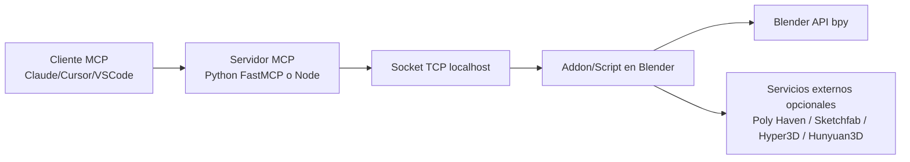

cle# MCP Blender (Workspace Analysis)

## Descripcion del proyecto
Este repositorio combina **dos implementaciones** relacionadas con MCP (Model Context Protocol) para controlar Blender desde un cliente LLM (Claude, Cursor, VS Code):

1. **Implementacion principal (Python, en `blender-mcp/`)**
   - Addon de Blender (`blender-mcp/addon.py`) que levanta un socket TCP en Blender.
   - Servidor MCP (`blender-mcp/src/blender_mcp/server.py`) basado en `mcp.server.fastmcp`.
   - Integraciones opcionales con Poly Haven, Sketchfab, Hyper3D y Hunyuan3D.

2. **Implementacion alternativa/simple (raiz del workspace)**
   - Servidor MCP en Node (`server.mjs`) con herramientas basicas (crear cubo, esfera, cilindro, limpiar escena, ejecutar Python).
   - Receptor socket simple en Blender (`blender_socket_server.py`).
   - Scripts de modelado de ejemplo (`make_butterfly.py`, `make_shrimp.py`, `make_shrimp_detailed.py`).

## Objetivo real del sistema
Permitir que un agente MCP (como Claude) ejecute operaciones en Blender de forma remota/controlada por prompts, incluyendo:
- inspeccion de escena,
- creacion/modificacion de objetos,
- ejecucion de codigo Python en Blender,
- y (en la implementacion principal) uso de librerias externas de assets/modelos.

## Como deberia funcionar (flujo completo)

### Flujo principal (recomendado)
1. Instalar y habilitar `blender-mcp/addon.py` en Blender.
2. Iniciar conexion desde el panel BlenderMCP (puerto por defecto: `9876`).
3. Ejecutar el servidor MCP Python (`blender-mcp`) por stdio.
4. Configurar cliente MCP (Claude/Cursor/VS Code) para usar ese servidor.
5. El cliente invoca herramientas MCP -> `server.py` -> socket TCP -> addon en Blender.
6. Blender ejecuta comando y responde JSON al servidor MCP.

### Flujo alternativo (legacy/simple)
1. Levantar un receptor en Blender que acepte Python por socket (`blender_socket_server.py`, puerto `9999`).
2. Ejecutar servidor MCP Node (`server.mjs`) en stdio.
3. Configurar cliente MCP para apuntar al servidor Node.
4. Cliente invoca tools -> Node envia codigo Python -> Blender ejecuta.

## Arquitectura



## Tecnologias utilizadas
- **Python 3.10+**
- **Blender Python API (`bpy`)**
- **MCP Python SDK (`mcp[cli]`)**
- **Node.js (ESM)**
- **@modelcontextprotocol/sdk (Node)**
- **uv** (gestor recomendado en la implementacion principal)
- **requests, supabase, tomli** (en implementacion principal)

## Requisitos

### Requisitos base
- Blender 3.0+
- Python 3.10+
- Node.js 18+
- `uv` instalado (para flujo principal en `blender-mcp/`)

### Requisitos de servicios externos (opcionales)
- **Sketchfab API token** (si habilitas Sketchfab)
- **Hyper3D API key** (si habilitas Hyper3D)
- **Hunyuan3D SecretId/SecretKey** o URL de API local (si habilitas Hunyuan3D)
- **Poly Haven** no requiere key en este repo (usa endpoints publicos)

## Instalacion

### 1) Clonar/abrir el workspace
Abre la carpeta raiz `mcp-blender` en tu editor.

### 2) Backend principal (Python) - recomendado
```bash
cd blender-mcp
uv sync
```

### 3) Backend alternativo (Node) - opcional
```bash
npm install
```

### 4) Instalar addon en Blender
1. Blender -> Edit -> Preferences -> Add-ons
2. Install...
3. Selecciona `blender-mcp/addon.py`
4. Habilita el addon "Blender MCP"

## Variables de entorno
Variables reconocidas por el backend Python (`blender-mcp/src/blender_mcp/server.py`):

- `BLENDER_HOST` (default: `localhost`)
- `BLENDER_PORT` (default: `9876`)
- `DISABLE_TELEMETRY` (`true|1|yes|on` para desactivar)
- `BLENDER_MCP_DISABLE_TELEMETRY`
- `MCP_DISABLE_TELEMETRY`

Ejemplo (PowerShell):
```powershell
$env:BLENDER_HOST = "localhost"
$env:BLENDER_PORT = "9876"
$env:DISABLE_TELEMETRY = "true"
```

## Como ejecutar el backend

### Opcion A: Backend Python principal
```bash
cd blender-mcp
uv run blender-mcp
```

### Opcion B: Backend Node simple
```bash
node server.mjs
```

## Como ejecutar el frontend
Este repositorio **no contiene frontend web dedicado**.

Interfaces de usuario reales:
- Panel del addon en Blender (`BlenderMCP` en sidebar)
- Cliente MCP externo (Claude Desktop/Code, Cursor, VS Code)

## Como conectar Blender
1. Abre Blender con el addon habilitado.
2. En la vista 3D, abre sidebar (tecla `N`) -> pestaña `BlenderMCP`.
3. Verifica puerto (`9876` recomendado en implementacion principal).
4. Click en **Connect to MCP server** (o equivalente segun version).
5. Mantener Blender abierto mientras se usa MCP.

## Como configurar MCP

### Claude Desktop (flujo principal Python)
Configura `claude_desktop_config.json`:

```json
{
  "mcpServers": {
    "blender": {
      "command": "uvx",
      "args": ["blender-mcp"]
    }
  }
}
```

### Claude Desktop (flujo Node simple local)
```json
{
  "mcpServers": {
    "blender": {
      "command": "node",
      "args": ["ABSOLUTE_PATH_A/server.mjs"]
    }
  }
}
```

### Cursor/VS Code
Config equivalente MCP apuntando al servidor Python o Node.

## Como conectar Claude
1. Configura el server MCP en Claude (Desktop o Code).
2. Reinicia Claude si no detecta cambios.
3. Abre Blender y conecta el addon.
4. Verifica icono/herramientas MCP disponibles.
5. Prueba comando simple: "obten informacion de la escena".

## Solucion de problemas

### Error: no conecta con Blender
- Verifica que Blender addon este activo y "conectado".
- Revisa que `BLENDER_PORT` coincida con el puerto del addon.
- Asegura que solo una implementacion MCP este corriendo a la vez.

### Error: timeout
- Reduce el tamano/complejidad de la operacion.
- Reintenta con pasos pequenos.

### Error en servicios externos
- Sketchfab/Hyper3D/Hunyuan3D requieren credenciales validas.
- Revisa internet y credenciales en panel BlenderMCP.

### Error: MCP no aparece en cliente
- Revisa JSON de configuracion MCP.
- Reinicia cliente (Claude/Cursor/VS Code).
- Confirma que el comando (`uvx`, `uv run`, `node`) exista en PATH.

## Estado actual del proyecto (real del repo)

### Lo que si esta implementado
- Servidor MCP Python funcional (FastMCP) en `blender-mcp/src/blender_mcp/server.py`.
- Addon Blender robusto en `blender-mcp/addon.py`.
- Integraciones opcionales (Poly Haven, Sketchfab, Hyper3D, Hunyuan3D).
- Servidor MCP Node simple en `server.mjs`.

### Problemas detectados que bloquean o degradan ejecucion
1. **Falta `requirements.txt`** en el workspace (aunque `pyproject.toml`/`uv.lock` existen).
2. **`zod` no esta declarada** como dependencia directa en `package.json` pero se importa en `server.mjs`.
3. **`config.json` tiene ruta hardcodeada** a otra maquina (`C:\\Users\\ESPE-SD\\...`).
4. **Desalineacion de puertos** entre flujos (`9999` legacy vs `9876` principal).
5. **`make_shrimp_detailed.py` contiene error de sintaxis** (tupla incompleta).
6. **Modulo de configuracion de telemetria faltante**: `blender-mcp/src/blender_mcp/config.py` se referencia pero no existe en el repo.
7. **Versiones inconsistentes**: `blender-mcp/src/blender_mcp/__init__.py` declara `0.1.0` mientras `pyproject.toml` declara `1.5.5`.
8. **Metadata pendiente** en `pyproject.toml` (autor/URLs placeholder).

## Componentes pendientes
- Unificar y documentar oficialmente si el flujo soportado es Python, Node, o ambos.
- Corregir dependencia Node faltante y rutas de configuracion local.
- Resolver manejo de configuracion/secretos de telemetria (`config.py` ausente).
- Agregar pruebas minimas de smoke/integracion.
- Publicar guia unica de arranque para Windows/macOS/Linux alineada con este repo (no solo con upstream).

## Roadmap sugerido
1. **Estabilizacion de arranque**: rutas, puertos, dependencias, config.
2. **Consolidacion de arquitectura**: elegir flujo principal y marcar el otro como legacy.
3. **Hardening**: validaciones, timeouts, manejo de errores y seguridad en ejecucion de codigo.
4. **DX**: scripts de setup automatizado, checks de entorno y troubleshooting guiado.
5. **Calidad**: pruebas de conexion Blender<->MCP y CI basica.
6. **Documentacion final**: guia de produccion y matriz de compatibilidad por plataforma.

## Informacion faltante (explicita)
- No hay documentacion local que defina claramente si el backend Node de raiz sigue oficialmente soportado.
- No se incluye `requirements.txt`; la fuente de verdad Python parece ser `pyproject.toml` + `uv.lock`.
- No se incluye `src/blender_mcp/config.py` (referenciado por telemetria), por lo que su formato esperado no esta documentado en este repo.
- No hay frontend web en el repositorio; la UX depende de clientes MCP externos y del panel Blender.
