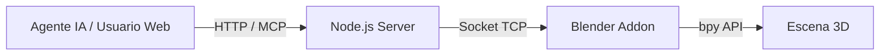

# MCP Blender Integration 🚀


Un puente avanzado de comunicación que permite a Agentes de Inteligencia Artificial (LLMs) como **Claude**, **Hermes** y **OpenCode** interactuar, controlar y generar modelos en **Blender 3D** en tiempo real utilizando el **Model Context Protocol (MCP)**.

---

## 📖 Descripción del Proyecto

Este proyecto conecta la capacidad de razonamiento y generación de código de los LLMs modernos directamente con la API de Python de Blender. A través de este sistema, un agente de IA puede inspeccionar tu escena, crear geometrías complejas, modificar materiales y ejecutar operaciones 3D de forma autónoma.

El proyecto está diseñado con una arquitectura cliente-servidor dividida en dos componentes principales:
1. Un **servidor web/MCP en Node.js** que provee una interfaz gráfica de usuario (GUI) amigable y actúa como orquestador.
2. Un **Addon en Python para Blender** que levanta un socket interno para recibir y ejecutar comandos de forma segura en el entorno 3D.

## ✨ Características Principales

- 🧠 **Integración MCP Nativa**: Permite a modelos compatibles con MCP invocar herramientas directamente sobre la escena de Blender.
- 🎨 **Interfaz Web Interactiva**: Panel de control en el navegador para monitorear comandos, visualizar métricas y gestionar los motores de IA activos.
- 🔌 **Múltiples LLMs Soportados**: Preparado para trabajar con **Claude Code**, **OpenCode**, **Hermes** o reglas personalizadas.
- ⚡ **Ejecución en Tiempo Real**: Los scripts generados por la IA se inyectan y ejecutan en la sesión activa de Blender instantáneamente.
- 🛡️ **Seguridad Integrada**: Los comandos viajan a través de sockets locales, aislando el entorno de ejecución.

## 🏗️ Arquitectura del Sistema



## 📋 Requisitos Previos

Asegúrate de tener instalado en tu sistema:
- **Blender** (Versión 4.1 o superior, compatible con Blender 5.x)
- **Node.js** (Versión 18 o superior)
- **Python** (Versión 3.10 o superior)

## 🚀 Instalación y Configuración

### 1. Configurar el Servidor Web (Node.js)

Abre una terminal en la raíz del proyecto e instala las dependencias:

```bash
# Instalar dependencias
npm install

# Iniciar el servidor web
npm run web
```
El servidor quedará escuchando por defecto en el puerto `3000`. Puedes abrir `http://localhost:3000` en tu navegador para ver la interfaz.

### 2. Instalar el Addon en Blender

1. Abre **Blender**.
2. Ve a `Edit` > `Preferences` > `Add-ons`.
3. Haz clic en **Install...** y selecciona el archivo `blender-mcp/addon.py`.
4. Marca la casilla para habilitar el addon **"Blender MCP"**.
5. En la vista 3D de Blender, presiona la tecla `N` para abrir el panel lateral y busca la pestaña **BlenderMCP**.
6. Asegúrate de que el puerto configurado (ej. `9876`) coincida y presiona **Connect to MCP server**.

## 💻 Uso del Sistema

Una vez que ambos componentes (Node.js y el addon de Blender) están en ejecución:

1. Abre la interfaz web en `http://localhost:3000`.
2. Selecciona tu **Motor de IA** preferido (Ej: Claude Code).
3. Utiliza la caja de comandos para pedirle a la IA que cree o modifique algo en la escena. Ejemplos:
   - *"Crea 3 esferas alineadas en el eje X"*
   - *"Genera un script de python para modelar una mariposa"*
   - *"Limpia la escena completa"*
4. La IA procesará tu instrucción a través del servidor MCP, escribirá el script necesario utilizando la API `bpy` de Blender, y lo enviará al socket local para que Blender lo ejecute frente a tus ojos.

## 🤖 Conexión a Modelos de IA (LLMs)

El sistema lee las configuraciones de los motores desde `ai-engines.json`. Cada motor requiere ser instalado globalmente en tu sistema operativo para que el servidor Node.js pueda invocarlo por consola (CLI). 

### 1. Claude Code (Recomendado)
* **Cuenta Requerida:** Cuenta Claude Pro (suscripción de pago de Anthropic).
* **API Key:** **NO requiere API Key** de desarrollador. Se vincula mediante el inicio de sesión OAuth estándar de tu navegador.
* **Instalación / Versión:** Requiere el paquete oficial (última versión). Instálalo con: `npm install -g @anthropic-ai/claude-code`.
* **Cómo conectarlo:** Abre una terminal, escribe el comando `claude` y presiona Enter. Se abrirá tu navegador para autorizar la conexión. Una vez hecho, nuestro panel web lo detectará y usará automáticamente.

### 2. OpenCode (Open Source)
* **Cuenta Requerida:** Cuenta gratuita en OpenCode.ai (o vinculación con Github/Google).
* **API Key:** **NO requiere API Key** en tu `.env`. Usa el token de sesión de la aplicación.
* **Instalación / Versión:** Requiere el CLI oficial. Instálalo con: `npm install -g opencode-ai` o mediante `curl -fsSL https://opencode.ai/install | bash`.
* **Cómo conectarlo:** Si usas la app de escritorio de OpenCode, tu sesión se comparte automáticamente con la consola (`opencode run`). El orquestador web se anclará a esta sesión.

### 3. Hermes (por Nous Research)
* **Cuenta Requerida:** No exige cuenta propia rígida (el agente enruta internamente a LLMs gratuitos como Gemini).
* **API Key:** **NO requiere API Key** manual.
* **Instalación / Versión:** Se instala su binario directamente. En Linux/WSL/Mac: `curl -fsSL https://hermes-agent.nousresearch.com/install.sh | bash`.
* **Cómo conectarlo:** El sistema se comunica ejecutando `hermes -z`. En entornos estrictos de Windows (como antivirus Norton) el agente usa sus propios certificados SSL locales (`ca-bundle.pem`) ya mapeados en la configuración.

> **💡 Nota sobre APIs externas en Blender:** Si decides usar extensiones internas de Blender (como la integración con Poly Haven, Sketchfab, Hyper3D o Hunyuan3D), **SÍ** necesitarás sus respectivas API Keys, las cuales se configuran en el archivo `.env` o en el panel `BlenderMCP` en Blender. Para mover y crear mallas (operaciones estándar del LLM), ninguna API key es necesaria.

---

## 🔄 Cómo replicar y arrancar el entorno desde cero

Si acabas de clonar el repositorio y quieres ponerlo a funcionar, sigue este orden exacto:

1. **Prepara las dependencias del sistema:** 
   * **Node.js**: Instala la **versión 18.x o superior**.
   * **Python**: Instala la **versión 3.10 o superior**.
   * **Blender**: Instala la **versión 4.1 o superior** (comprobado en Blender 5.x).
2. **Instala las dependencias del orquestador:** En la raíz del repositorio, ejecuta `npm install`. (Esto instalará Express 5.2, Three.js 0.185 y el SDK de MCP).
3. **Instala tu agente de IA preferido:** Por ejemplo, instala `claude-code` de forma global (`npm i -g @anthropic-ai/claude-code`), ábrelo una vez en tu terminal escribiendo `claude` e inicia sesión.
4. **Instala el Addon en Blender:** Abre Blender, ve a Preferencias > Add-ons > Instalar, selecciona `blender-mcp/addon.py` y actívalo.
5. **¡Enciende el sistema!**
   * **Paso A:** En la terminal (en la raíz de este proyecto), ejecuta `npm run web`. Deja esta terminal abierta de fondo.
   * **Paso B:** En Blender (panel lateral pulsando `N` > BlenderMCP), asegúrate de que el puerto sea `9876` y presiona el botón **"Connect to MCP server"**.
   * **Paso C:** Abre tu navegador en `http://localhost:3000`, selecciona tu motor en la esquina superior derecha y comienza a escribir instrucciones.

## 📁 Estructura del Repositorio

- `/web/`: Contiene la lógica del frontend (HTML/JS/CSS) y el servidor Express (`server.mjs`).
- `/blender-mcp/`: Contiene la lógica en Python, el código del addon (`addon.py`) y las integraciones del protocolo MCP.
- `package.json`: Definición de dependencias de Node.js.
- `ai-engines.json`: Configuración de las rutas y parámetros de los distintos LLMs integrados.

## 🔒 Privacidad y Seguridad

Al utilizar este sistema de forma local:
- Todos los scripts se ejecutan en tu entorno de Blender (`localhost`). 
- No se envían datos confidenciales de la escena hacia servidores externos que no sean los propios LLMs que hayas autorizado a usar tu contexto mediante MCP.
- Asegúrate de nunca subir a un repositorio público el archivo `.env` u otros archivos que contengan API Keys o rutas locales de tu máquina.

## 📄 Licencia

Este proyecto se distribuye bajo la licencia **MIT**. Siéntete libre de modificarlo, distribuirlo y usarlo en tus proyectos personales o de investigación.
